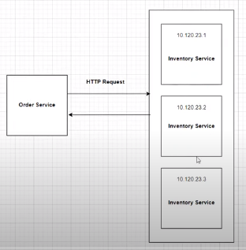

Logical architecture of each services.

In controller layer we will be receiving http request from client.
All the business logic will be written in Service layer. And in some of service we will be communicating to message queue.
And repository layer takes to the database.

Here we are making synchronous communication between order service and inventory service using webclient.

Here in local environment we are calling local uri directly like uri("http://localhost:8082/api/inventory"
but in production everything will be deployed in cloud environment and in cloud environment we cannot
have dedicated ip addresses because everything will be dynamic and may run on different ports. And we 
may have multiple instances of inventory service like in below diagram.

Now here how our order service knows which instance to be called.
For this reason we have pattern called Service Discovery pattern.
Service Discovery is creating a server called as Discovery Server which will store all the information 
about services. Its also called as service registry. 

Now lets see how communication happens in below figure.

In this way we can avoid hardcode of url by making use of discovery server.

When making initial call to Discovery Service it also sends its registory as the response to the client
and client stores local copy and if for some reason discovery server is not available then it first checks
local copy. And if all the local instanes are also down then it will fail the communitcation.

For this all we need to create discovery server in our project.