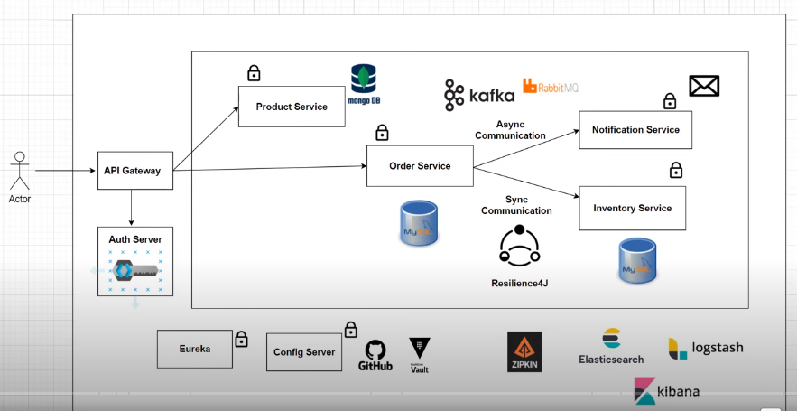

Logical architecture of each services.

In controller layer we will be receiving http request from client.
All the business logic will be written in Service layer. And in some of service we will be communicating to message queue.
And repository layer takes to the database.

